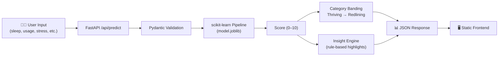
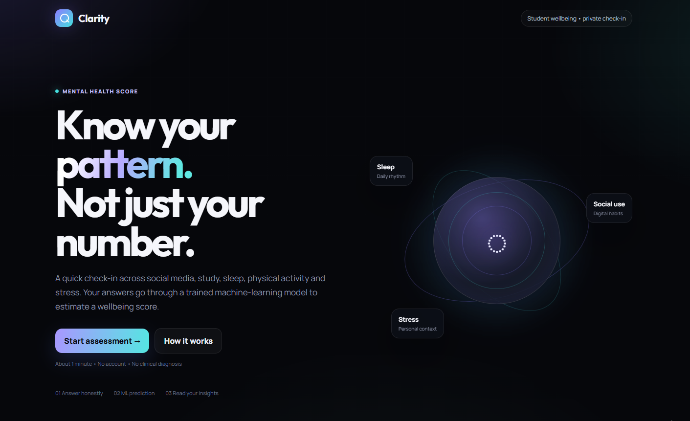
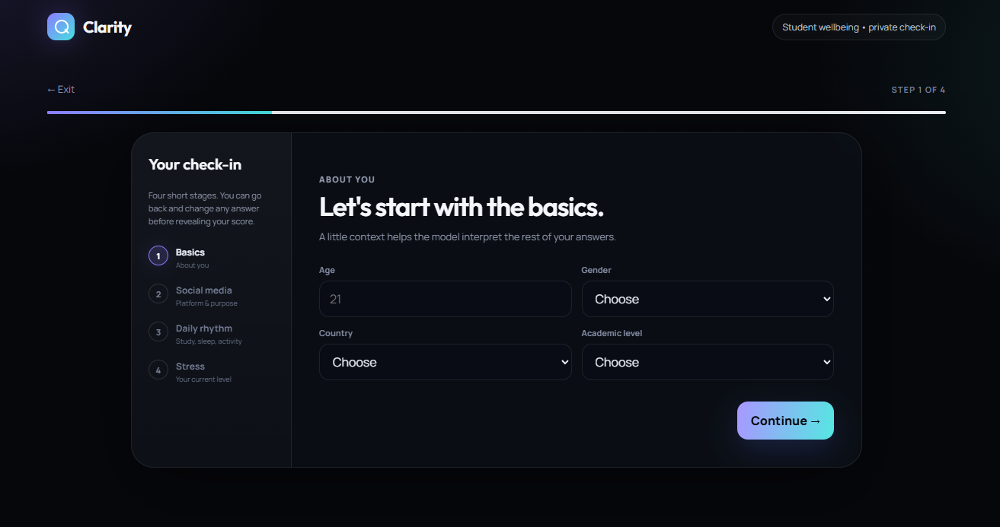
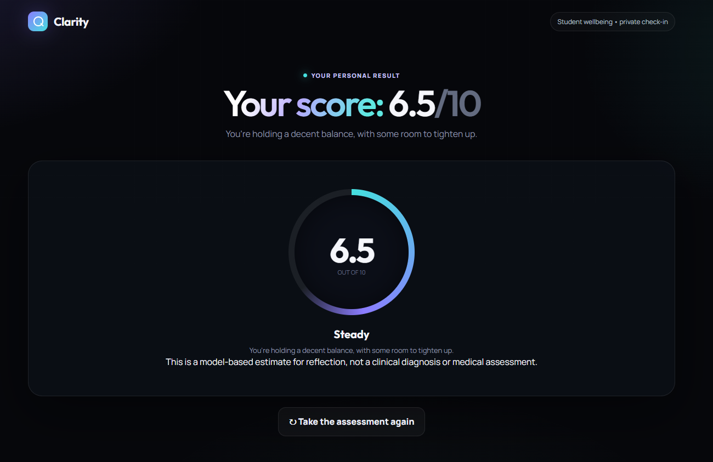

<div align="center">


### Student Mental Health Score Predictor

**Turn a student's daily habits into a clear, actionable mental health signal — powered by Machine Learning and served through a fast, production-grade FastAPI backend.**

<br/>

[](https://mental-health-score-k41h.onrender.com/)
[](https://hub.docker.com/r/omkarmandhare/mental-health-score)
[](https://mental-health-score-k41h.onrender.com/docs)

<br/>


<br/>

**[🚀 Try the Live App](https://mental-health-score-k41h.onrender.com/)** &nbsp;•&nbsp;
**[🐳 Docker Hub](https://hub.docker.com/r/omkarmandhare/mental-health-score)** &nbsp;•&nbsp;
**[📂 Source](https://github.com/OMKARMANDHARE/clarity-mental-health-score)** &nbsp;•&nbsp;
**[🐛 Issues](https://github.com/OMKARMANDHARE/clarity-mental-health-score/issues)**

</div>

<br/>

---

## 📋 Table of Contents

- [Overview](#-overview)
- [Features](#-features)
- [How It Works](#-how-it-works)
- [Live Demo](#️-live-demo)
- [Tech Stack](#️-tech-stack)
- [Project Structure](#-project-structure)
- [Getting Started](#-getting-started)
  - [Run Locally](#option-a--run-locally)
  - [Run with Docker](#option-b--run-with-docker-recommended)
- [Environment Variables](#-environment-variables)
- [API Reference](#-api-reference)
- [Scoring Model](#-scoring-model)
- [Contributing](#-contributing)
- [License](#-license)
- [Author](#-author)

---

## 🌼 Overview

**Clarity** takes a snapshot of a student's daily life — screen time, sleep, study load, physical activity, and stress — and turns it into:

- A **mental health score** out of 10
- A plain-English **category** (from `Redlining` to `Thriving`)
- **Targeted insights** on the 1–3 habits most affecting their wellbeing

It's built the way a real product should be: a validated ML pipeline behind a typed FastAPI contract, containerized for reproducibility, and live on the web — not just a notebook.

> 💡 **Why this matters:** small, everyday habits — an hour less sleep, two extra hours of scrolling — compound into real wellbeing outcomes. Clarity makes that connection visible and quantifiable instead of anecdotal.

## ✨ Features

<table>
<tr>
<td width="50%" valign="top">

**🎯 Instant, quantified scoring**
A trained regression pipeline converts 11 lifestyle inputs into a single, interpretable 0–10 score in milliseconds.

**🏷️ Human-readable categories**
Scores are bucketed into five bands (*Thriving → Redlining*) so results are meaningful at a glance, not just a number.

**💡 Personalized insights**
Automatically surfaces the top drivers behind a score — sleep debt, high screen time, low activity, high stress, or burnout risk.

</td>
<td width="50%" valign="top">

**⚡ Production-grade API**
Async lifespan model loading, strict Pydantic v2 validation, structured error responses, and auto-generated OpenAPI docs.

**🐳 Fully containerized**
One `docker pull` away from running anywhere — no local Python setup required.

**☁️ Live & deployed**
Publicly hosted on Render with a working frontend, not just a bare API.

</td>
</tr>
</table>

## 🔍 How It Works



1. The frontend (or any client) sends lifestyle data to `POST /api/predict`.
2. FastAPI validates every field with Pydantic — bad input never reaches the model.
3. The pre-trained scikit-learn pipeline scores the input.
4. The score is clamped to `[0, 10]`, banded into a category, and paired with rule-based insights.
5. A structured JSON response is returned and rendered in the UI.

## 🖥️ Live Demo

<div align="center">

**🔗 [mental-health-score-k41h.onrender.com](https://mental-health-score-k41h.onrender.com/)**

<!-- 📸 Replace this with a real screenshot or GIF for maximum impact: -->
<!--  -->

</div>

> ⚠️ Deployed on Render's free tier — the first request after a period of inactivity may take **30–60 seconds** while the instance spins up.


## 📸 Screenshots

### Homepage



### Assessment



### Result




## 🛠️ Tech Stack

| | |
|---|---|
| **Backend** |    |
| **Machine Learning** |     |
| **Frontend** |    |
| **DevOps** |   |

## 📂 Project Structure

```
clarity-mental-health-score/
├── data/              # Dataset(s) used for model training
├── notebooks/         # EDA & model training notebooks
├── static/            # Frontend assets (index.html, CSS, JS)
├── main.py            # FastAPI app — schemas, scoring logic, routes
├── model.joblib        # Pre-trained scikit-learn pipeline
├── requirements.txt   # Python dependencies
└── README.md
```

## 🚀 Getting Started

### Prerequisites

- Python 3.12+
- pip
- Docker (optional, for containerized runs)

<details open>
<summary><b>Option A — Run Locally</b></summary>

<br/>

```bash
# 1. Clone the repo
git clone https://github.com/OMKARMANDHARE/clarity-mental-health-score.git
cd clarity-mental-health-score

# 2. Create & activate a virtual environment
python -m venv venv
source venv/bin/activate        # Windows: venv\Scripts\activate

# 3. Install dependencies
pip install -r requirements.txt

# 4. Launch the app
uvicorn main:app --reload --host 0.0.0.0 --port 8000
```

App: **http://localhost:8000** &nbsp;|&nbsp; Swagger docs: **http://localhost:8000/docs**

</details>

<details>
<summary><b>Option B — Run with Docker (recommended)</b></summary>

<br/>

**Pull the pre-built image:**

```bash
docker pull omkarmandhare/mental-health-score
docker run -d -p 8000:8000 --name clarity omkarmandhare/mental-health-score
```

**...or build it from source:**

```bash
docker build -t clarity-mental-health-score .
docker run -d -p 8000:8000 --name clarity clarity-mental-health-score
```

Then open **http://localhost:8000**.

> 🔧 If your Dockerfile exposes a port other than `8000`, update the `-p` flag and `uvicorn --port` value to match.

</details>

## 🔐 Environment Variables

| Variable | Default | Description |
|---|---|---|
| `MODEL_PATH` | `model.joblib` (next to `main.py`) | Path to the trained model file |
| `ALLOWED_ORIGINS` | `*` | Comma-separated list of allowed CORS origins |
| `LOG_LEVEL` | `INFO` | Logging verbosity |

## 📡 API Reference

**Base URLs** — Local: `http://localhost:8000` &nbsp;|&nbsp; Live: `https://mental-health-score-k41h.onrender.com`

<details open>
<summary><b><code>GET /api/health</code></b> — service & model status</summary>

<br/>

```json
{ "status": "ok", "model_loaded": true }
```

</details>

<details open>
<summary><b><code>POST /api/predict</code></b> — get a mental health score</summary>

<br/>

**Request body**

| Field | Type | Allowed values / range |
|---|---|---|
| `Age` | int | `1`–`99` |
| `Gender` | string | `Male`, `Female` |
| `Country` | string | India, USA, Canada, Australia, UK, Germany, Turkey, Mexico, France, Spain, Other |
| `Academic_Level` | string | High School, Undergraduate, Graduate |
| `Most_Used_Platform` | string | Facebook, Instagram, KakaoTalk, LINE, LinkedIn, Snapchat, TikTok, Twitter, VKontakte, WeChat, WhatsApp, YouTube |
| `Purpose_Of_Use` | string | Education, Entertainment, Networking, News |
| `Avg_Daily_Usage_Hours` | float | `0`–`24` |
| `Study_Hours` | float | `0`–`24` |
| `Physical_Activity_Hours` | float | `0`–`24` |
| `Sleep_Hours_Per_Night` | float | `0`–`24` |
| `Stress_Level` | string | Low, Medium, High, Very High |

**Example request**

```bash
curl -X POST "https://mental-health-score-k41h.onrender.com/api/predict" \
  -H "Content-Type: application/json" \
  -d '{
    "Age": 21,
    "Gender": "Male",
    "Country": "India",
    "Academic_Level": "Undergraduate",
    "Most_Used_Platform": "Instagram",
    "Purpose_Of_Use": "Entertainment",
    "Avg_Daily_Usage_Hours": 5.5,
    "Study_Hours": 4,
    "Physical_Activity_Hours": 0.5,
    "Sleep_Hours_Per_Night": 5,
    "Stress_Level": "High"
  }'
```

**Example response**

```json
{
  "score": 4.2,
  "score_out_of": 10.0,
  "category_key": "wobbly",
  "category_label": "Wobbly",
  "summary": "A few habits are pulling your wellbeing down more than they should.",
  "insights": [
    { "key": "sleep", "label": "Sleep is under 6 hours a night — this is likely the single biggest lever you have." },
    { "key": "activity", "label": "Very little movement in your day — even short walks tend to shift mood." }
  ]
}
```

</details>

Interactive, always-up-to-date docs are auto-generated by FastAPI at **`/docs`** (Swagger UI) and **`/redoc`**.

## 🧪 Scoring Model

| Score range | Category | Meaning |
|---|---|---|
| 8.0 – 10.0 | 🟢 **Thriving** | Habits are largely working in your favor |
| 6.0 – 7.9 | 🟡 **Steady** | Decent balance, some room to tighten up |
| 4.0 – 5.9 | 🟠 **Wobbly** | A few habits are pulling wellbeing down |
| 2.0 – 3.9 | 🔴 **Running Low** | Several factors working against you at once |
| 0.0 – 1.9 | ⚫ **Redlining** | Current routine is taking a real toll |

The pipeline (`model.joblib`) is a pre-trained scikit-learn model built on student social-media and lifestyle survey data. Training, feature exploration, and evaluation live in the `notebooks/` directory.


## 🤝 Contributing

Contributions, issues, and feature requests are welcome!

```bash
# 1. Fork the repo
# 2. Create your feature branch
git checkout -b feature/your-feature

# 3. Commit your changes
git commit -m "Add: your feature"

# 4. Push and open a Pull Request
git push origin feature/your-feature
```

## 📄 License

Distributed under the **MIT License**. See [`LICENSE`](https://github.com/OMKARMANDHARE/clarity-mental-health-score/blob/main/LICENSE) for details.

## 👤 Author

**Omkar Mandhare**

[](https://github.com/OMKARMANDHARE)
[](https://hub.docker.com/r/omkarmandhare/mental-health-score)

---

<div align="center">

**If Clarity helped you, consider giving the repo a ⭐ — it genuinely helps!**

</div>
